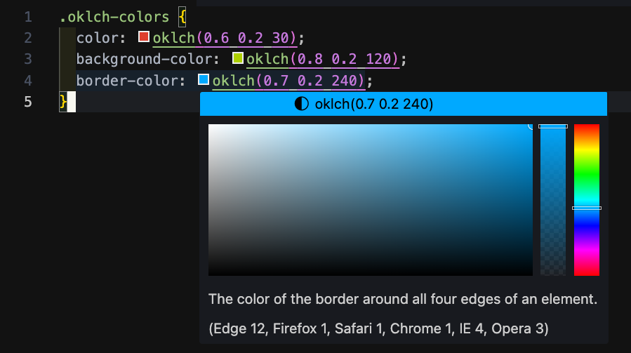

# OKLCH-AS

OKLCH-AS is a Visual Studio Code extension designed to simplify working with OKLCH colors. It allows developers and designers to view and modify OKLCH color values directly within the editor, enhancing productivity and streamlining color management workflows.

## Features

- **Display OKLCH Colors**: Quickly view a list of OKLCH color values used in your project.
- **Edit Colors**: Interactively change OKLCH color values with real-time validation to ensure correct formatting.
- **User-Friendly Interface**: Seamless integration with VS Code's command palette for easy access.

Ideal for web developers and UI/UX designers who want precise control over OKLCH color schemes in their projects.

## Screenshots

### Displaying OKLCH Colors

### Changing an OKLCH Color

## Changelog
See [CHANGELOG.md](CHANGELOG.md) for details.